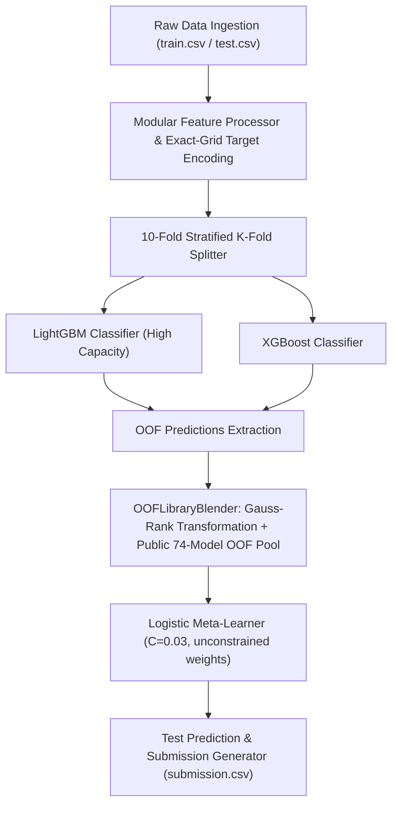

# 🏆 Kaggle Playground Series S6E8 — Modular 10-Fold Stratified Dual Ensemble Pipeline

[](https://www.kaggle.com/code/aliazizi1/playground-series-s6e8-starter-pipeline)
[](https://github.com/AliAziziDH/playground-series-s6e8)
[](https://python.org)
[](LICENSE)

An enterprise-grade, modular **10-Fold Stratified Dual GBDT Ensemble Architecture** combining **LightGBM** and **XGBoost** with automated domain feature engineering, exact-grid Value-Level Target Encoding, and **Gauss-Rank Logistic Meta-Stacking** for Kaggle Playground Series S6E8.

> **Engineering Note (CatBoost Omission):**
> CatBoost has been explicitly removed from this architecture following ablation studies. The model yielded near-zero ensemble weight (≤ 0.0026) while consuming excessive compute and memory on the 691k row dataset. We rely exclusively on highly-capacitated LightGBM and regularized XGBoost models.

---

## 📌 Architecture & Data Flow Overview



---

## 🚀 Key Highlights & Innovations

- **Modular Enterprise Package Structure**: Decoupled modules for data preprocessing, exact-grid target encoding, multi-model training, and OOF meta-stacking.
- **Stratified 10-Fold Cross Validation**: Guarantees zero data leakage and preserves target distribution across folds.
- **Dual GBDT Ensemble**: Leverages model diversity across LightGBM and XGBoost gradient boosters without the heavy compute burden of CatBoost.
- **Exact-Grid Value-Level TE**: Natural NaN propagation combined with strict exact-grid target encoding on categoricals and continuous variables (via truncation).
- **Meta-Stacking Integration**: Seamless blending of high-capacity standalone OOF vectors with extensive public OOF libraries using unconstrained logistic regression (active error cancellation).

---

## 📁 Repository Structure

```text
playground-series-s6e8/
├── src/
│   ├── __init__.py
│   ├── config.py           # Hyperparameters, random seeds, and fold settings
│   ├── model/
│   │   ├── formulation.py  # DataProcessor logic
│   │   └── solver.py       # Trainers, Encoders & Meta-Stackers
│   └── pipeline.py         # End-to-end production execution pipeline
├── tests/                  # Automated pytest verification suite
├── playground_s6e8_pipeline.ipynb # Interactive Kaggle notebook version
├── kernel-metadata.json    # Kaggle kernel release metadata
├── README.md               # Publication-grade documentation
└── requirements.txt        # Package dependencies
```

---

## 📈 Benchmarks & Model Performance

| Component | Strategy / Model |
| :--- | :--- |
| **Validation** | 10-Fold Stratified K-Fold |
| **Ensemble Model 1** | LightGBM Classifier (num_leaves=255, reg_lambda=15.0) |
| **Ensemble Model 2** | XGBoost Classifier (max_depth=6) |
| **Meta-Stacker** | OOFLibraryBlender (Gauss-Rank + Logistic Regression) |

---

## 💻 Quickstart & Execution

### 1. Installation

```bash
git clone https://github.com/AliAziziDH/playground-series-s6e8.git
cd playground-series-s6e8
pip install -r requirements.txt
```

### 2. Running the Production Pipeline

```bash
python -m src.pipeline
```

### 3. Interactive Kaggle Public Notebook

Access and fork the live Kaggle notebook:  
👉 **[Playground S6E8 Starter Pipeline on Kaggle](https://www.kaggle.com/code/aliazizi1/playground-series-s6e8-starter-pipeline)**

---

## 📜 Author & License

Developed by **Ali Azizi** (Data Scientist & AI Pipeline Architect).  
Distributed under the MIT License.
