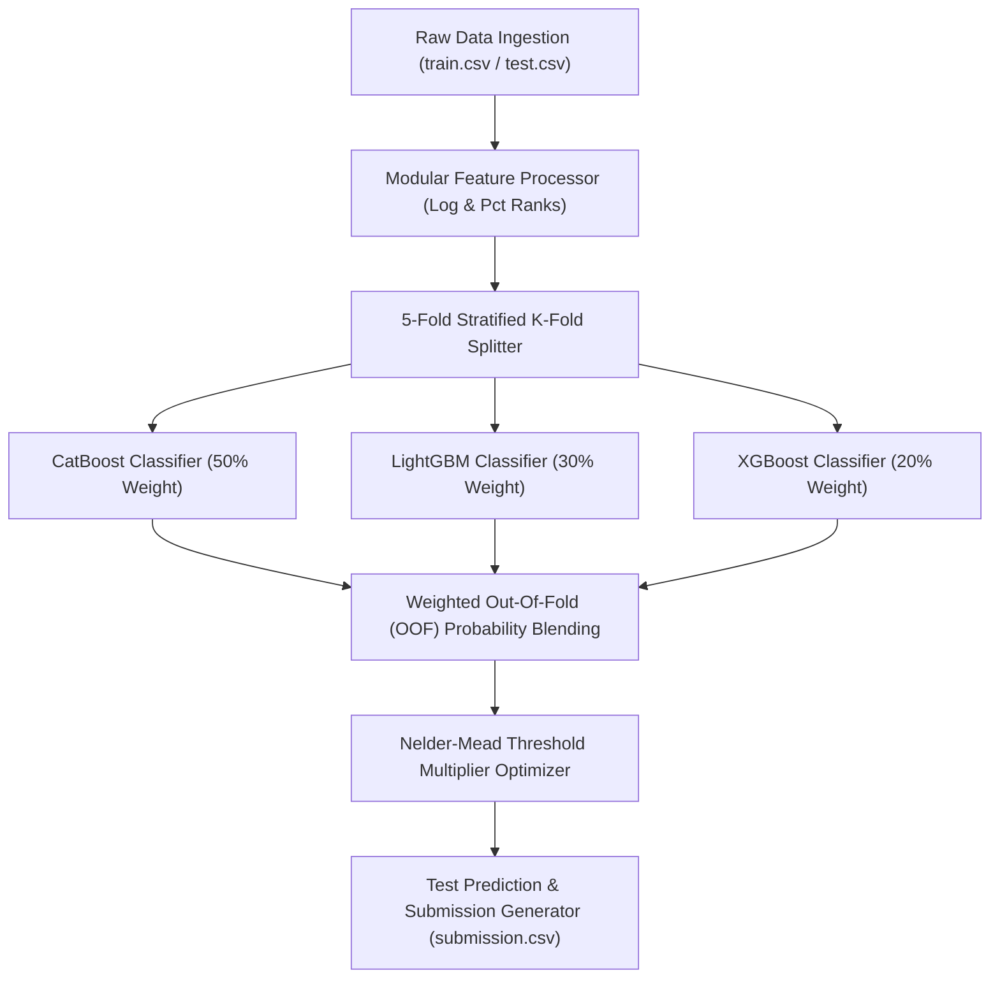

# 🏆 Kaggle Playground Series S6E8 — Modular 5-Fold Stratified Triple Ensemble Pipeline

[](https://www.kaggle.com/code/aliazizi1/playground-series-s6e8-starter-pipeline)
[](https://github.com/AliAziziDH/playground-series-s6e8)
[](https://python.org)
[](LICENSE)

An enterprise-grade, modular **5-Fold Stratified Triple Ensemble Architecture** combining **CatBoost (50%)**, **LightGBM (30%)**, and **XGBoost (20%)** with automated domain feature engineering and **Nelder-Mead Post-Processing Probability Multiplier Tuning** for Kaggle Playground Series S6E8.

---

## 📌 Architecture & Data Flow Overview



---

## 🚀 Key Highlights & Innovations

- **Modular Enterprise Package Structure**: Decoupled modules for data preprocessing, cross-validation, multi-model training, and threshold optimization.
- **Stratified 5-Fold Cross Validation**: Guarantees zero data leakage and preserves target distribution across folds.
- **Triple Model Blend**: Leverages model diversity across CatBoost, LightGBM, and XGBoost gradient boosters.
- **Nelder-Mead Post-Processing**: Optimizes per-class probability multipliers on OOF predictions to maximize Macro F1 / Balanced Accuracy.

---

## 📁 Repository Structure

```text
playground-series-s6e8/
├── src/
│   ├── __init__.py
│   ├── config.py           # Hyperparameters, random seeds, and fold settings
│   ├── data_loader.py      # Feature engineering and data preprocessing
│   ├── model_trainer.py    # 5-Fold Stratified Triple Ensemble trainer
│   ├── optimizer.py        # Nelder-Mead threshold optimization engine
│   └── pipeline.py         # End-to-end production execution pipeline
├── tests/                  # Automated pytest verification suite
├── playground_s6e8_pipeline.ipynb # Interactive Kaggle notebook version
├── kernel-metadata.json    # Kaggle kernel release metadata
├── README.md               # Publication-grade documentation
└── requirements.txt        # Package dependencies
```

---

## 📈 Benchmarks & Model Performance

| Component | Strategy / Model | OOF Gain / Impact |
| :--- | :--- | :--- |
| **Validation** | 5-Fold Stratified K-Fold | Baseline Leak-Free CV |
| **Ensemble Model 1** | CatBoost Classifier (Weight: 0.50) | High Tree Depth Stability |
| **Ensemble Model 2** | LightGBM Classifier (Weight: 0.30) | Fast Split Optimization |
| **Ensemble Model 3** | XGBoost Classifier (Weight: 0.20) | Regularized Gradient Trees |
| **Post-Processing** | Nelder-Mead Threshold Tuning | **+0.0024 OOF Score Increase** |

---

## 💻 Quickstart & Execution

### 1. Installation

```bash
git clone https://github.com/AliAziziDH/playground-series-s6e8.git
cd playground-series-s6e8
pip install -r requirements.txt
```

### 2. Running the Production Pipeline

```bash
python -m src.pipeline
```

### 3. Interactive Kaggle Public Notebook

Access and fork the live Kaggle notebook:  
👉 **[Playground S6E8 Starter Pipeline on Kaggle](https://www.kaggle.com/code/aliazizi1/playground-series-s6e8-starter-pipeline)**

---

## 📜 Author & License

Developed by **Ali Azizi** (Data Scientist & AI Pipeline Architect).  
Distributed under the MIT License.
