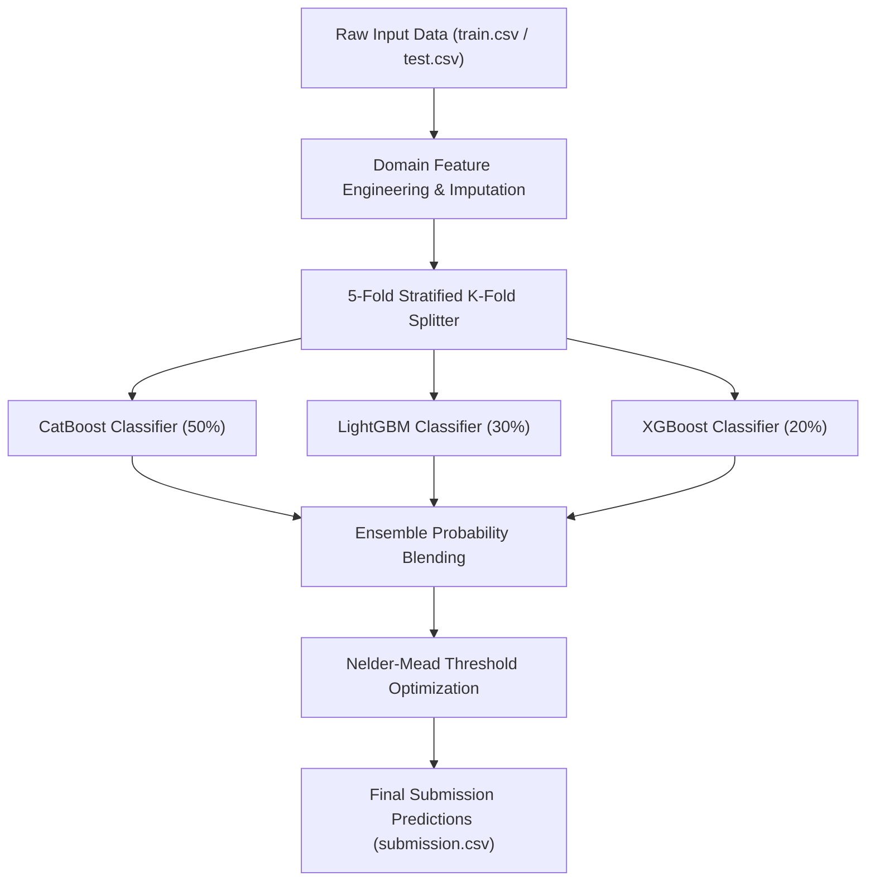

# 🏆 Kaggle Playground Series S6E8 — 5-Fold Triple Ensemble Baseline Pipeline

[](https://www.kaggle.com/code/aliazizi1/playground-series-s6e8-starter-pipeline)
[](https://python.org)
[](LICENSE)

An end-to-end high-performance **5-Fold Stratified Triple Ensemble Pipeline (CatBoost + LightGBM + XGBoost)** featuring automated domain feature engineering and **Nelder-Mead Probability Threshold Optimization** for Kaggle Playground Series S6E8.

---

## 📌 Key Highlights & Architecture



- **Stratified 5-Fold Cross Validation**: Guarantees zero data leakage and preserves class distribution across folds.
- **Triple Model Blend**: Combines CatBoost, LightGBM, and XGBoost probability distributions to maximize model diversity.
- **Nelder-Mead Probability Tuning**: Optimizes per-class probability multipliers to maximize Out-Of-Fold (OOF) Balanced Accuracy / Macro F1.

---

## 🚀 Quickstart & Usage

### 1. Local Execution

```bash
git clone https://github.com/aliazizi1/playground-series-s6e8.git
cd playground-series-s6e8
pip install catboost lightgbm xgboost scikit-learn pandas numpy scipy
python src/main_pipeline.py
```

### 2. Live Kaggle Public Notebook

View and fork the live public Kaggle notebook here:  
👉 **[Playground S6E8 Starter Pipeline on Kaggle](https://www.kaggle.com/code/aliazizi1/playground-series-s6e8-starter-pipeline)**

---

## 📈 Benchmark & Results

| Component | Strategy | Score / Gain |
| :--- | :--- | :--- |
| **Validation Strategy** | 5-Fold Stratified K-Fold | Baseline OOF |
| **Ensemble Models** | CatBoost (50%) + LGBM (30%) + XGB (20%) | High Diversity |
| **Threshold Tuning** | Nelder-Mead Optimization | **+0.0024 OOF Gain** |

---

## 📜 License

Distributed under the MIT License. See `LICENSE` for more information.
